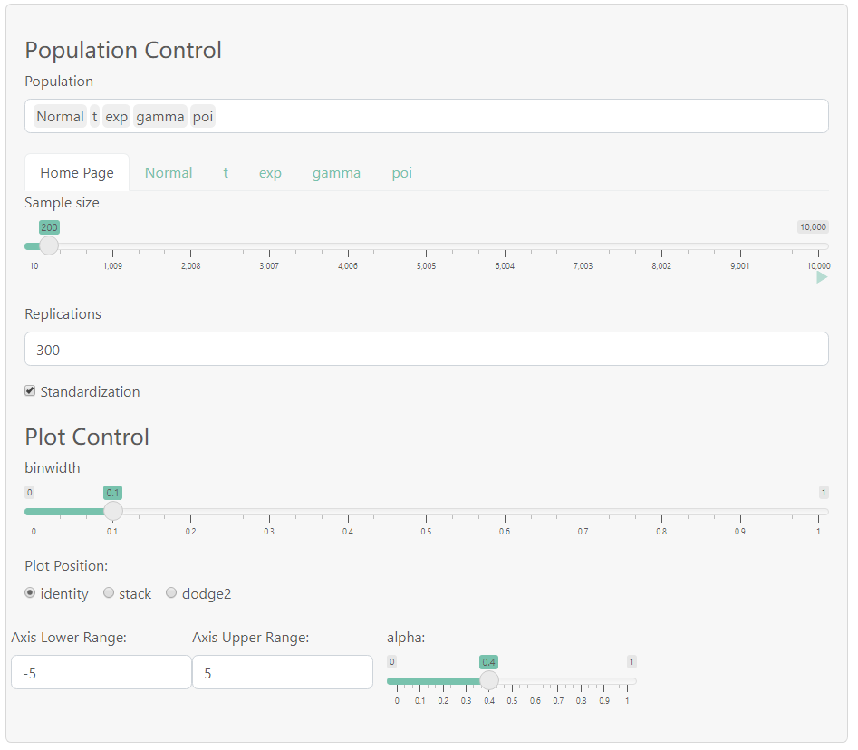
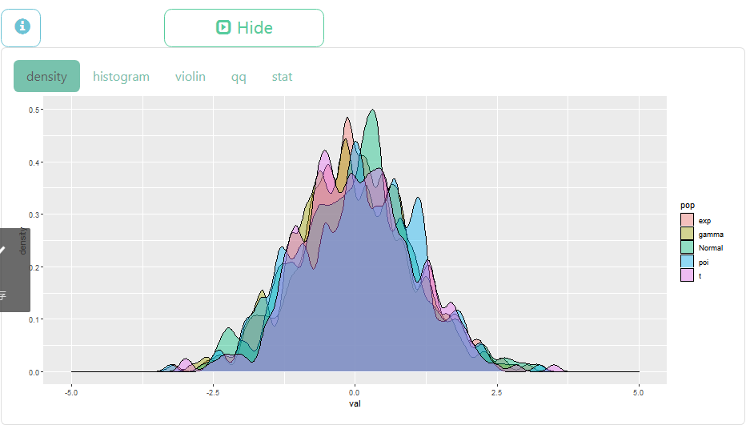
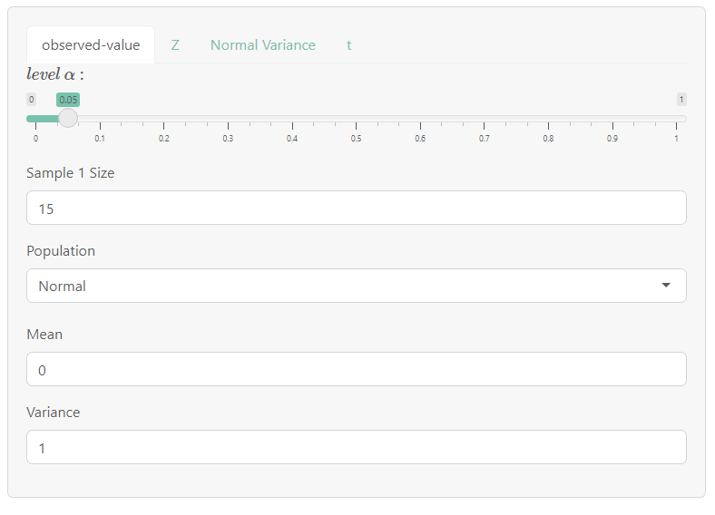
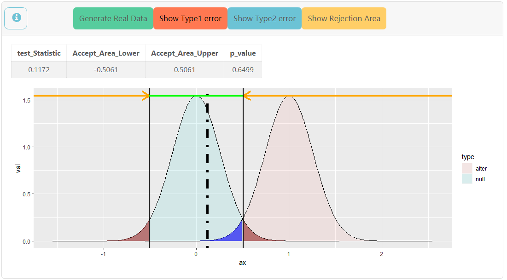

# StatEduDemo

**一个简单的统计教学演示网页**

- [随机抽样，并用于验证中心极限定理、交叉比较不同分布的渐进性质](#anchor1)

- [简单统计假设检验的基本思想与概念](#anchor2)

- 基于Rshiny与ggplot2实现

- 网站地址:[https://littleys.shinyapps.io/ElementaryStatDemo](#https://littleys.shinyapps.io/ElementaryStatDemo)

- [更多想法](#anchor5)

***

## 
内容

<h6 id='anchor1'></h6>

## 
**随机样本**

---

**侧边栏**可以选择并控制总体分布(基本是常见分布),可同时选择多个，下方会动态生成各个分布的控制面板

+ *Home Page* 

控制各组分布的样本容量n，抽样次数rep,是否标准化(影响中心极限定理的作图)

+ *分布名 如 Normal chi-square gamma ......*

    -  前面几行是常见分布的参数，建议输入有效值

    -   Statistic行可输入符合R语法的**向量化表达式**，得到统计量
    
        - x为样本,n为样本容量，可使用baseR与rlang的函数
    
        - 如:**mean(x),sd(x)^2 ,sort(x)[n]**，

          可分别得到样本均值 $\bar{x}$，样本方差 $\frac{\Sigma_1^n(x_i-\bar{x})^2}{n-1}$ ，样本最大值$x_{(n)}$
        - ~~实验功能，有待完善~~
        > 待填坑: 对数学公式的支持
+ **any** 使用Accept-Reject-Algorithm,生成满足一定条件的p.d.f的样本
        
    - 需要输入符合R语法的p.d.f表达式与其支集[a,b],上界M

    - 参数数目可选，依次为par1,par2,...

    - 限制较多，实用性不强

  
 
  
A-R算法详情

    
    $$ 设f为p.d.f,有紧致支集[a,b]与上界M,按如下算法,可得到r.v \  X \sim f \\
    Step \ 1.  生成随机变量Y \sim U(a,b)  \\ 
    Step \ 2.  生成随机变量V \sim U(0,M)  \\ 
    若 V \leq f(Y),则令X=V ; 否则，回到Step \ 1 \\ 
    Proof: \ 计算X的分布(转换为Y,V的条件概率)即可 \\
    Remark: \ 算法效率较低，且限制较多。
    $$
  

+   选择分布以后会出现Plot Control面板，可以控制作图，作图参数详见ggplot2

---

**主面板**生成并控制图像种类

+ Show Plot/Hide Plot 顾名思义

+ density 密度图

+ histogram 直方图

+ violin 小提琴图

+ qq Q-Q图

+ stat 生成自定义统计量的密度图(与Statistic行相关)

---

<h6 id='anchor2'></h6>

## 
**假设检验**

一些简单正态总体检验(主要是熟悉基础概念)

[侧边栏](#anchor3)控制参数，[主面板](#anchor4)作图，可以展示Type 1/2 Error与拒绝域，并动态地观察调整理论值以后的变化

---

<h6 id='anchor3'></h6>

### 假设检验1

处理单样本$x_1,x_2,x_3,...,x_n$情况的假设检验。

#### observed-value  控制样本的真实分布，**建议设置好参数后再进行检验**

  + level $ \alpha $ 控制检验水平，默认值0.05

  + Sample 1 Size 样本容量

  + Population 选择真实分布，选择后会出现参数控制面板

#### 简单检验
  
  **控制逻辑是通用的**
    
  + Type of $H_0$ 选择假设种类，双边/单边

  + $\mu_0$ 控制$\Theta_0$边界值

  + test0 选择$\Theta_0$中的测试值

  + test1 选择$\Theta_1$中的测试值

##### Z

>单样本Z检验，当正态总体方差$\sigma^2$已知时，对均值$\mu$的检验。

参数 $\sigma^2$ , 检验中“已知”的总体方差

##### Normal Variance

>正态总体方差检验，对正态总体方差$\sigma^2$的检验。

参数 $\mu \, known$ , 总体均值是否已知，影响卡方分布的自由度(检验统计量也应变化，~~还没加上去~~)

##### t
    
>单样本 *t* 检验，正态总体方差未知时，对均值$ \mu $的检验

参数 $\sigma$ ， 检验中未知的总体标准差(影响test1曲线的生成)

---

### 假设检验2

处理两样本$x_1,x_2,x_3,...,x_n;y_1,y_2,y_3,...,y_m$情况的检验

#### observed-value 控制样本的真实分布，**非常强烈建议设置好参数后在进行检验，尤其是样本2，不然会报错**
  + level $ \alpha $ 控制检验水平，默认值0.05

  + Sample 1 控制样本一，控制面板同假设检验1

  + Sample 2 控制样本二，控制面板同假设检验1

#### 简单检验
  
  **控制逻辑是通用的**
    
  + Type of $H_0$ 选择假设种类，双边/单边

  + $\mu_0$ 控制$\Theta_0$边界值

  + test0 选择$\Theta_0$中的测试值

  + test1 选择$\Theta_1$中的测试值

##### Z

> 两样本Z检验，当两组样本的总体方差均已知时，对均值差$ \mu_1-\mu_2 $的检验

参数 $\sigma_1^2 \,  \, \sigma_2^2$ , 检验中“已知”的总体方差

##### F

> F检验，对两组样本方差之比$\frac{\sigma^2_1}{\sigma^2_2}$的检验

参数 $\mu_1 \, known \, ,\, \mu_2 \, known$ , 任一样本的均值是否已知，影响F分布的自由度(检验统计量也应变化，~~还没加上去~~)

##### t

> 两样本 $t$ 检验, 当两组样本的总体方差未知但已知相等时，对均值差$ \mu_1-\mu_2 $的检验

参数 $\sigma$ ， 检验中未知的总体标准差(影响test1曲线的生成)

>> 待填坑: 对正态总体方差信息完全无知时对均值差的检验

---

<h6 id='anchor4'></h6>

### 主面板

例图为Z检验  $H_0: \mu_0 = 0$ <-----> $H_1: \mu_0 \neq 0$

样本为$X_1,X_2,...,X_{15} \sim N(0,1) \ \ i.i.d$  

检验水平$\alpha = 0.05$,作图选取了 $test0 = 0,test1 = 1$

+ Generate Real Data 生成真实分布的样本(每次点击都会重新生成)

+ Show Type1 error,显示会发生Ⅰ型错的区域(图中深红部分)

+ Show Type2 error,显示会发生Ⅱ型错的区域(图中深蓝部分)

+ Show Rejection Area 显示拒绝域 (橙色箭头下方) 与接受域 (绿色线段下方)

  |test_Statistic |Accept_Area_Lower| Accept_Area_Upper|p_value|
  |:----------:|:------:|:------:|:------:|
  |当前样本所得到的检验统计量的值|接受域的下界|接受域的上界|当前样本的p值|

+ 图片中淡蓝区域边界为零假设下检验统计量的理论概率密度曲线，浅红区域边界为对立假设下检验统计量的理论概率密度曲线。**黑色虚线**为直线x=test_Statistic。

+ 解读:当前抽样样本的样本均值为0.1172，落在拒绝域$R: (-\infty,-0.5061) \cup (0.5061,\infty)$外，故不能拒绝零假设

---

<h6 id='anchor5'></h6>

## For suggestions and bug reports,contacts me at [xys201821@mail.ustc.edu.cn](https://www.bilibili.com/video/BV1GJ411x7h7)