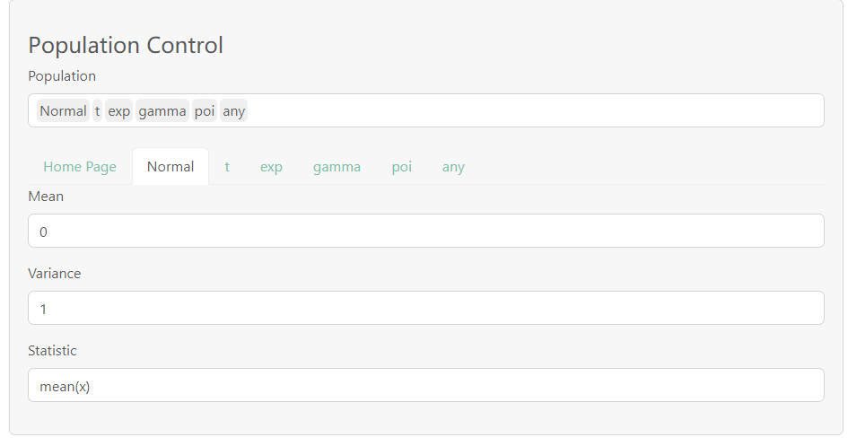
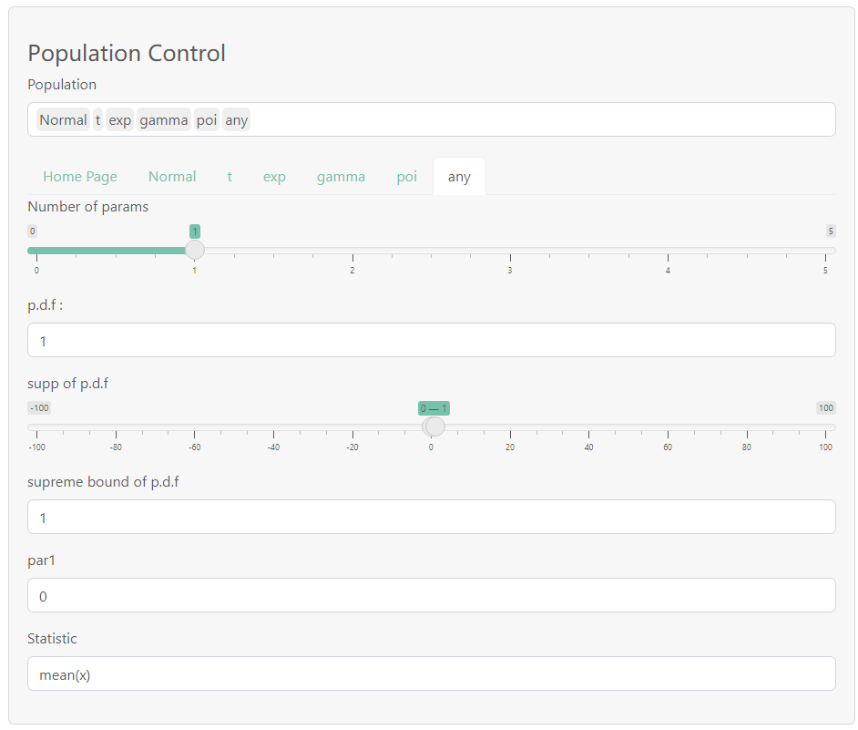
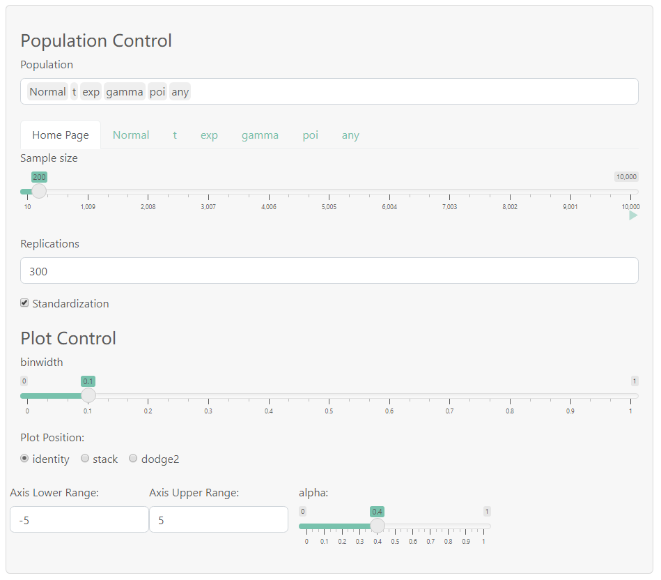
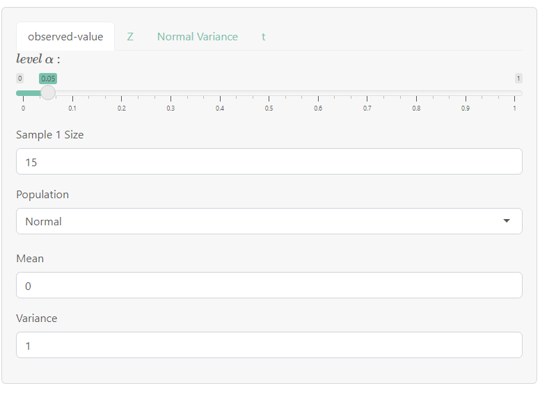
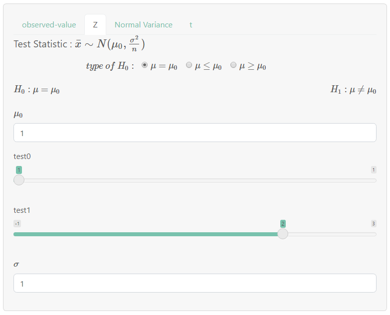
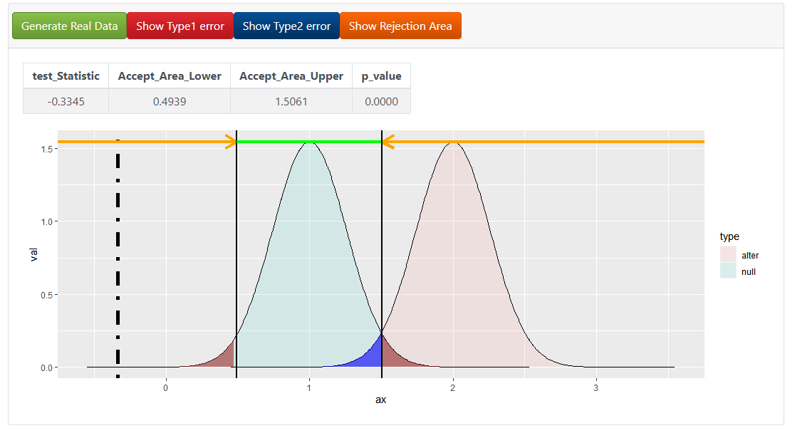

# StatEduDemo 开发报告   

*一个简单的统计教学演示网页*

<hr style="border-width:5px;border-color:#005"></hr>
## 开发目的

- 辅助统计教学,加强理解
    - [中心极限定理图像演示、交叉比较不同分布的渐进性质](#anchor1)

    - 用户可对自定义的分布进行随机抽样，利用[Accept-Reject算法](theory.md)

    - 简单的计算器

    - 通过简单的假设检验例子帮助理解[统计假设检验的基本思想与概念](#anchor2)

- 强用户交互

- 网站地址:[https://littleys.shinyapps.io/ElementaryStatDemo](#https://littleys.shinyapps.io/ElementaryStatDemo)

- 基于Rshiny与ggplot2实现

- [更多想法 ~~还未实现~~](#anchor5)

<hr style="border-width:5px;border-color:#005"></hr>

## 网页功能

*详情可见[用户介绍](README.md)*

- Random Sampling

- Simple Hypothesis Testing

<hr style="border-width:5px;border-color:#005"></hr>

## <center> 开发过程</center>

 [<center>前端逻辑</center>](#anchor3)

 [<center>后端逻辑</center>](#anchor4)


---

<h6 id='anchor3'></h6>

## **前端逻辑**

- About this Site
[用户介绍](README.md)
- Central Limit Theorem
    - 侧边栏
        - Pop Control
            - Poplist Select 选择需要抽样的分布类型(可多选)
            
                <font color="000066">根据Poplist,动态生成控制每个总体的分页</font>

                <details>
                <summary><font color="0000dd">图片效果</font></summary>
                
                常见总体的控制面板——需要输入: 参数表params,统计量表达式statistic
                

                任意总体的控制面板——需要输入: nparam参数数目(参数依次为par1,par2,...) 密度函数表达式p.d.f 支撑集[a,b] 上界M  统计量表达式
                

                </details>
            - Home Page 
            
                控制样本容量 n , 重复抽样次数 rep 以及 ggplot2 作图的参数
                
                <details>
                <summary><font color="0000dd">图片效果</font></summary>

                

                </details>
                

    - 主面板
        - Show/Hide Plot 控制图片显示

        - Density/Histogram/Violin/qq/stat 作图类型选择

- 假设检验1
    - 侧边栏
        - Observed Value 控制真实分布
            - Pop Control 控制总体分布的参数,与<font color="000066">随机抽样</font>的布局一样,Sample Size即为样本容量n

            - Axis Control 控制坐标轴范围

            <details>
            <summary><font color="0000dd">图片效果</font></summary>

            

            </details>

        - Z/Normal Variance/t 简单检验的例子,需要展示假设检验的基本情况,以及一些必要的参数。

            <details>
            <summary><font color="0000dd">图片效果</font></summary>

            

            </details>
    - 主面板
        - Buttons 控制随机抽样 | 显示一型错 | 显示二型错 | 显示拒绝域

        - Table 对观测到的样本进行检验的结果, 检验统计量的值 | 接受域 | p-value |

        - Graph 
        
             理论图像: 检验统计量的理论分布<font color="660000">(*即导出该假设检验所用到的那种分布*)</font>在$\Theta_0 , \Theta_1$中特定值下的图像，并在图中显示理论的Ⅰ型错、Ⅱ型错 , ~~拒绝域~~
                
        - ~~功效函数图像(还没做)~~

            <details>
            <summary><font color="0000dd">图片效果</font></summary>

            

            </details>
- 假设检验2 具体布局类似假设检验1，只是抽样样本要多一组
<h6 id='anchor4'></h6>

## **后端逻辑**

### <center>随机抽样</center>

---
    
#### **Pop Control 总体分布控制**
1. Home Page 简单的静态分页，主要是通用的参数

2. 通过SelectizeInput获取用户选择的多个总体(poplist)

   <font color="000066">*server端返回的 input$poplist 为一个字符型向量*</font>

3. 在server端根据poplist,动态添加/删除每个总体的分页<font color="660000">(关键)</font>

4. 每个总体的控制面板由统一的框架生成，集合在一个函数paraInput (~~体力活~~) 中。特定总体的第i个参数id的命名统一为'总体名+par+i', '总体名'+par2 (如正态分布的参数id为Normalpar1,Normalpar2,分别对应均值与方差)。

<details>
<summary> <font color = "dd0000">代码实现</font>(动态分页) </summary>

```r
    output$homepage<-renderUI({  # homepage
      tagList( 
        sliderInput(NS(id,"n"),"Sample size",min = 10,max = 10000,value = 50,animate=TRUE),
        numericInput(NS(id,"rep"),"Replications",value = 10),
        checkboxInput(NS(id,"standard"),"Standardization",value=TRUE)
      )
    })
    #append parameter control panel
    observeEvent(input$poplist,{ 
      validate(need(length(input$poplist) > length(par_ctrl()),"")) 
      purrr::map(input$poplist[!input$poplist %in% par_ctrl()],
                 ~appendTab("popgroup",tabPanel(.x,  #添加分页
                                                    parainput(.x,id),
                                                    textInput(NS(id,paste0(.x)),"Statistic",value="mean(x)",placeholder = "R expr of test statistic")
                                                    #提供计算统计量的R表达式的输入窗口
                                               )
                           )
                 )
      par_ctrl(input$poplist) #更新par_ctrl
    })
    #remove parameter control panel
    observe({
      validate(need(length(input$poplist) < length(par_ctrl()),"")) 
      purrr::map(par_ctrl()[!par_ctrl() %in% input$poplist],~removeTab("popgroup",.x))  #删除分页
      par_ctrl(input$poplist) #更新par_ctrl
    })
    par_ctrl<-reactiveVal(NULL)# poplist 变化时，与目前生效的总体列表par_ctrl进行比较，更新控制面板
```

</details>

---

#### **Random Sampling 抽样过程**

1.  generate函数—实现对每种分布进行随机抽样
2.  Server端里用df存储抽样信息
<details>
<summary> <font color = "660000">代码实现</font> generate </summary>

```r
# 常见分布调用R自带的抽样函数即可
generate<-function(n=1,pop="Normal",params=list(...)){
  a<-params$par1
  b<-params$par2
  c<-params$par3
  if (pop!="any")
    stopifnot(logical(pop,a,b,c))
  switch (pop,
          "Normal" = rnorm(n,mean=a,sd=sqrt(b)),
          #正态,均值为a,方差为b

          "t" = rt(n,df = a, ncp = b),
          #t分布,自由度为a,非中心参数为b

          "F" = rf(n,df1 = a,df2 = b,ncp = c),
          #F分布,分子自由度为a,分母自由度为b,非中心参数为c

          "exp" = rgamma(n,shape = 1, rate = a),
          #指数分布,参数为b

          "gamma" = rgamma(n,shape = a, rate = b),
          #伽马分布,形状参数为a,位置参数为b

          "chi-square" = rchisq(n,a,ncp = b),
          #卡方分布,自由度为a,非中心参数为b

          "uniform" = runif(n,min=a,max=b),
          #均匀分布,下界为a,上界为b

          "binomial" = replicate(n,sum(sample(c(0,1),a,replace=TRUE,prob = c(1-b,b)))),
          #二项分布

          "geom" = rgeom(n,a)+1,
          "pascal" = replicate(n,sum(rgeom(a,b)+1)),
          #几何分布与帕斯卡(负二项)分布

          "poi" = rpois(n,lambda = a),
          # 泊松分布

          "hypergeo" = rhyper(n,b,a-b,k=c),
          #超几何分布
          
          "any" = replicate(n,A_R(params))
          
  )
}#生成样本
```
</details>

<details>
<summary> <font color = "dd0000">代码实现</font> df </summary>


```r
    #更好的版本,不同分布的抽样过程放在不同的reactive block里，互不影响，
    #generate r.v series
    df <- purrr::map(dist1,~reactive({
      pop<-.x
      if (! pop %in% par_ctrl())
          return(NULL)
      npar <- ifelse(.x=="any",input$nparam,3)
      params<-purrr::map(paste0("par",as.character(seq(npar))),~input[[paste0(pop,.x)]]) #获取参数的值
      names(params)<-paste0("par",as.character(seq(npar)))
      if (pop=="any")
      {
        params$m<-input$bound
        params$supp<-input$supp
        params$f<-input$pdf
      }
      #replicate重复生成多组样本
      tmp <- replicate(input$rep,list(generate(input$n,pop,params)))
      tmp1 <- purrr::map_dbl(tmp,~mean(.x))
      if (input$standard)
        tmp1<-standardize(input$n,pop,params,tmp1)
      t<-purrr::map_dbl(tmp,~rlang::eval_tidy(str2lang(input[[pop]]),data = params,new_data_mask(env(x = .x,n = input$n))) )
      # t为统计量计算的结果,str2lang将R表达式文本转成R表达式,根据params值与每组样本的值.x,调用eval_tidy计算统计量的值
      list(test = data.frame(val=t,pop=pop), clt = data.frame(val=tmp1,pop=pop))
    }))
```

```r
    #旧版本,抽样过程统一放在同一个reactive block里，一次性完成所有分布的抽样，缺点是更改任一分布的参数，都会重新给所有分布抽样，严重影响运行速度
    if (FALSE){ #注释，旧写法
      df<-reactive({
        validate(need(length(input$poplist) > 0,""))
        validate(need(!hideplot(),""))
        d<-input$poplist
        names(d)<-d
        purrr::map_dfr(d,~({
           pop<-.x
           npar <- ifelse(.x=="any",input$nparam,3)
           params<-purrr::map(paste0("par",as.character(seq(npar))),~input[[paste0(pop,.x)]]) #获取参数的值
           names(params)<-paste0("par",as.character(seq(npar)))
           if (pop=="any")
           {
              params$m<-input$bound
              params$supp<-input$supp
              params$f<-input$pdf
           }
           #replicate重复生成多组样本
           tmp <- replicate(input$rep,list(generate(input$n,pop,params)))
           tmp1 <- purrr::map_dbl(tmp,~mean(.x))
           if (input$standard)
             tmp1<-standardize(input$n,pop,params,tmp1)
           t<-purrr::map_dbl(tmp,~rlang::eval_tidy(str2lang(input[[pop]]),
            # t为统计量计算的结果,str2lang将R表达式文本转成R表达式,根据params值与每组样本的值.x,调用eval_tidy计算统计量的值
           data = params,new_data_mask(env(x = .x,n = input$n))) )
           list(test = data.frame(val=t,pop=pop), clt = data.frame(val=tmp1,pop=pop))
        }))
          #A<-rbind(A,data.frame(val=tmp, pop = c(d[i])))
       # purrr::map_dfr(input$poplist,~data.frame(val=A[[.x]],pop=c(.x)))
      })
    }
```
</details>

---

#### **Plot Control 主面板画图**
1. 用actionButton控制图片显示与隐藏(显示文字会变化)

2. 画图,调用df
<details>
<summary> <font color = "660000">代码实现</font> 按钮变化 </summary>

```r
buttonswitch<-function(id,astring,bstring,state){
      if (state)
        updateActionButton(session,id,astring)
      else
        updateActionButton(session,id,bstring)
    }
    hideplot<-reactiveVal(TRUE)
    observeEvent(input$hidebutton,{
      hideplot(!hideplot())
      buttonswitch("hidebutton","Show","Hide",hideplot())
    })
```
</details>

<details>
<summary> <font color = "660000">代码实现</font> 画图 </summary>

```r
    output$density<-renderPlot({
      validate(need(!hideplot(),""))
      ifelse(is_concrete(input$poplist),"",return(NULL))
      data <- purrr::map_dfr(dist1,~df[[.x]]())
      p <- ggplot(data$clt,aes(x=val,fill=pop)) + geom_density(adjust=1,alpha = input$alpha, position = input$pos, bw = input$bw)
      p <- p+xlim(input$axis1,input$axis2)
      p
    })
    output$hist<-renderPlot({
      validate(need(!hideplot(),""))
      ifelse(is_concrete(input$poplist),"",return(NULL))
      data <- purrr::map_dfr(dist1,~df[[.x]]())
      p<-ggplot(data$clt,aes(x=val,fill=pop))+geom_histogram(alpha=input$alpha, position = input$pos, binwidth = input$bw)
      p <- p+xlim(input$axis1,input$axis2)
      p
    })
    output$violin<-renderPlot({
      validate(need(!hideplot(),""))
      validate(need(input$poplist,""))
      ifelse(is_concrete(input$poplist),"",return(NULL))
      data <- purrr::map_dfr(dist1,~df[[.x]]())
      p<-ggplot(data$clt,aes(y=val,x=pop,fill=pop))+geom_violin(alpha=input$alpha,  position = input$pos)+geom_jitter(aes(y=val,x=pop),width = 0.4,height=0.01)
      p
    })
    output$qq<-renderPlot({
      validate(need(!hideplot(),""))
      ifelse(is_concrete(input$poplist),"",return(NULL))
      data <- purrr::map_dfr(dist1,~df[[.x]]())
      p<-ggplot(data$clt,aes(sample=val,color=pop))+geom_qq(alpha=input$alpha,  position = input$pos)+geom_qq_line()
      p <- p+xlim(input$axis1,input$axis2)
      p
    })
    output$stat<-renderPlot({
      validate(need(!hideplot(),""))
      data <- purrr::map_dfr(dist1,~df[[.x]]())
      p<-ggplot(data$test,aes(x=val,fill=pop))+geom_density(alpha=input$alpha, position = input$pos, bw = input$bw)
      p <- p+xlim(input$axis1,input$axis2)
      p
    })
```
</details>

<hr style="border-width:5px;"></hr>

<br>

### <center>假设检验(1与2实现方式基本一样)</center>

#### **observed-value**  控制抽样的面板和**随机抽样**部分相同，产生样本的方式也一样

---

#### **Z/Normal Variance/t/...**

1. 调用MathJax引擎显示数学公式，主要是检验统计量与两种假设的形式

2. 所有检验都在同一框架下处理,在Server端通过动态变化的type_test记录当前选择的检验的名称。每个名称对应一个list,list里包含检验所需的所有信息(参数名与前端的显示文字)

3. Ui端用testInput()模块封装假设检验控制面板ui的静态部分

4. Server端分成多个模块处理(<font color ="660000">模块的参数与返回值都应包裹在reactive block中</font>): 

    1. uiServer 封装生成假设检验控制面板ui的动态部分(~~体力活~~)
    2. dataServer 封装产生理论曲线的数据的模块，返回list (list里是俩dataframe)
    3. realdataServer 封装获得实际样本参数的模块，返回list。
    4. real_data 每当按钮getdata被点击时，便利用当前realdataServer中的参数值调用generate，获得实际样本
    4. real_test 调用Call_teststat,计算实际样本real_data的检验统计量,返回double
    5. testServer 封装计算假设检验结果(拒绝域上下界，p值)的模块，返回list
    6. plotServer 封装画图的模块

5. 这一部分代码较复杂，每个模块的实现依赖于许多自定义的函数(建议参考源代码)

<details>
<summary> <font color = "660000">代码实现</font> 检验对应的list </summary>

```r
params_list <- function(id){
  default <- list(
    "es-Z" = list(h0="\\mu_0",h="\\mu",test0="test0",test1="test1",par1="\\sigma"),
    "Z" = list(h0="\\mu_0",h="\\mu",test0="test0",test1="test1",par1="\\sigma"),
    "es-Chi" = list(h0="\\sigma_0^2",h="\\sigma^2",test0="test0",test1="test1",par1="known"),
    "Chi" = list(h0="\\sigma_0^2",h="\\sigma^2",test0="test0",test1="test1",par1="known"),
    "ds-F" = list(h0="k_0",h="\\frac{\\sigma_1^2}{\\sigma_2^2}",test0="test0",test1="test1",par1="\\sigma_1^2",par2="known1",par3="known2"),
    "F" = list(h0="k_0",h="\\frac{\\sigma_1^2}{\\sigma_2^2}",test0="test0",test1="test1",par1="\\sigma_1^2",par2="known1",par3="known2"),
    "es-t" = list(h0="\\mu_0",h="\\mu",test0="test0",test1="test1",par1="\\sigma"),
    "t" = list(h0="\\mu_0",h="\\mu",test0="test0",test1="test1",par1="\\sigma"),
    "ds-Z2" = list(h0="\\mu_0",h="\\mu_1 - \\mu_2",test0="test0",test1="test1",par1="\\sigma_1",par2="\\sigma_2"),
    "Z2" = list(h0="\\mu_0",h="\\mu_1 - \\mu_2",test0="test0",test1="test1",par1="\\sigma_1",par2="\\sigma_2"),
    "ds-t2" = list(h0="\\mu_0",h="\\mu_1 - \\mu_2",test0="test0",test1="test1",par1="\\sigma"),
    "t2" = list(h0="\\mu_0",h="\\mu_1 - \\mu_2",test0="test0",test1="test1",par1="\\sigma"))
  return(default[[id]])
} #params list of default test

param_func <- function(id){
  switch (id,
    "Z" = ,
    "Z2" = dnorm,
    "t" = ,
    "t2" = dt,
    "F" = df,
    "Chi" = dgamma,
  )
} #func of default testt
```
</details>

<details>
<summary> <font color = "660000">代码实现</font> testInput </summary>

```r
jax <- function(...){
  withMathJax(paste(sep = " ","\\(",paste0(list(...),collapse = " "),"\\)"))
} #simplify math formula input
testInput <- function(id){
  params_name <- params_list(id)
  h0<-params_name$h0
  h<-params_name$h
  params_name$h0<-NULL
  params_name$h<-NULL
  tagList(
    fluidRow(style="margin:0 auto",
             span("\\( type \\  of \\  H_0 : \\)",style="margin-right: 15px;margin-left:20%"),
             radioButtons(NS(id,"h0type"),NULL,
                          choiceNames = list(jax(h,"=",h0),jax(h,"\\leq",h0),jax(h,"\\geq",h0)),
                          choiceValues = list("=","<",">"),inline=TRUE
             )),
    htmlOutput(NS(id,"h1type")),
    br("    "),
    numericInput(NS(id,"h0"),jax(h0),value=1),
    purrr::map(params_name, ~paramsInput(id,.x))
  )
}
```
</details>

<details>
<summary> <font color = "dd0000">代码实现</font> 计算检验统计量 </summary>

```r
#保存检验统计量的公式
testStat <- function(id){
  switch (id,
          "Z" = expr(mean(x)),
          "Chi" = expr((n-1)*sd(x)^2/h0),
          "t" = expr(sqrt(n)*(mean(x)-h0)/sd(x)),
          "Z2" = expr(mean(x)-mean(y)),
          "t2" = expr((mean(x)-mean(y)-h0)*sqrt(m*n/(m+n))/sqrt(((m-1)*sd(x)^2+(n-1)*sd(y)^2)/(n+m-2))),
          "F" = expr(sd(x)^2/sd(y)^2)
  )
}
real_test <- reactive(Call_testStat(type_test(),real_data,size))
#计算检验统计量
Call_testStat <- function(id,data,size){
  req(data())
  moduleServer(id,function(input,output,session){
    test_expr <- testStat(id)
    rlang::eval_tidy(test_expr,data(),env(h0 = input$h0, n = size()$n, m = size()$m))
  })
}
```
</details>

<details>
<summary> <font color = "dd0000">代码实现</font> 获得实际样本 </summary>

```r
realdataServer <- function(id,parent_id,size){
    moduleServer(id,function(input,output,session){
      output$real <- renderUI({
        parainput(input$pop,NS(parent_id,id))
      })
      reactive({
        pop<-input$pop
        npar <- ifelse(pop=="any",input$nparam,3)
        params<-purrr::map(paste0("par",as.character(seq(npar))),~input[[paste0(pop,.x)]])
        names(params)<-paste0("par",as.character(seq(npar)))
        if (pop=="any")
        {
          params$m<-input$bound
          params$supp<-input$supp
          params$f<-input$pdf
        }
        params$name <- pop
        params
      })
    })
}
```

```r
    pop1 <- realdataServer("1",id,size)
    pop2 <- realdataServer("2",id,size)
    real_data <- reactiveVal(NULL)
    observeEvent(input$getdata,{
      tmp1<-NULL
      if (size()$n>0) tmp1 <- generate(size()$n,pop1()$name,pop1())
      tmp2<-NULL
      if (size()$m>0) tmp2 <- generate(size()$m,pop2()$name,pop2())
      real_data(list(x=tmp1,y=tmp2))
    })
```

<details>
<summary> <font color = "dd0000">代码实现</font> testServer </summary>

```r
# *test是自己写的函数，没有调用stat包(因为参数格式不统一)，不保证正确
testServer <- function(id, size, level, real_test){
  params<-params_list(id)
  moduleServer(id,function(input,output,session){
    switch(id,
                 "Z" = ztest(size(),level(),input$h0,input[[params$par1]],input$h0type, real_test()),
                 "Chi" = chitest(size(),level(),input$h0,input[[params$par1]],input$h0type, real_test()),
                 "F" = ftest(size(),level(),input$h0,input[[params$par2]],input[[params$par3]],input$h0type, real_test()),
                 "t" = ttest(size(),level(),input$h0type,real_test()),
                 "Z2" = z2test(size(),level(),input$h0,input[[params$par1]],input[[params$par2]],input$h0type,real_test()),
                 "t2" = t2test(size(),level(),input$h0type,real_test())
    )
  })
}
```
</details>

</details>
<details>
<summary> <font color = "dd0000">代码实现</font> dataServer </summary>

```r
#获得生成图像的数据
dataServer <- function(id,size){
  moduleServer(id,function(input,output,session){
    params<-params_list(id)
    params_value<-reactive(purrr::map(params,~input[[.x]]))
    #生成数据
    alter_df<-reactive({
      req(params_value())
      par_tmp<-params_value()
      par_tmp$test<-par_tmp$test1
      tmp<-generate2(id,param_func(id),par_tmp,size(),input$h0)
      data.frame(ax= tmp$x,val = tmp$y, type=rep("alter"))
    })
    null_df<-reactive({
      req(params_value())
      par_tmp<-params_value()
      par_tmp$test<-par_tmp$test0
      tmp<-generate2(id,param_func(id),par_tmp,size(),input$h0)
      data.frame(ax= tmp$x,val = tmp$y, type=rep("null"))
    })
    list(
      null=null_df, 
      alter=alter_df
    )
  })
}
```
</details>

</details>
<details>
<summary> <font color = "dd0000">代码实现</font> plotServer </summary>

```r
    #调用画图的模块
    output$graph <- renderPlot({
      req(type_test())
      plotServer(type_test(),test_data,real_data,size,level = reactive(input$level),
                 show = reactive(list(one=input$show1, two=input$show2, three=input$show3, real=input$getdata)),
                 test = test_res,real_test)
    },res = 96)
    #画图的模块
    plotServer <- function(id, test_data, real_data, size, level,show,test,real_test){
  moduleServer(id,function(input,output,session){
    #generate the basic layer plot
    params <- params_list(id)
    g<-reactive({
      arrow_height<-max(c(test_data()$null()$val,test_data()$alter()$val))
      p<-ggplot(rbind(test_data()$null(),test_data()$alter()), aes(x=ax, y=val, group=type,fill=type)) + geom_area(alpha=0.1)+geom_line()
      if (show()$one %% 2 == 1){
        p<-p + geom_area(data = test_data()$null()[purrr::map_lgl(test_data()$null()$ax,~(.x>test()$upper)) ,],aes(x = ax,y = val), fill="brown", alpha=0.6)
        p<-p + geom_area(data = test_data()$null()[purrr::map_lgl(test_data()$null()$ax,~(.x<test()$lower)) ,],aes(x = ax,y = val), fill="brown", alpha=0.6)
      }
      if (show()$two %% 2 == 1){
        p<-p + geom_area(data = test_data()$alter()[purrr::map_lgl(test_data()$alter()$ax,~((.x<=test()$upper)&(.x>=test()$lower))) ,],aes(x = ax,y = val), fill="blue", alpha=0.6)
      }
      if (!is.na(real_test())){
        p<-p + geom_vline(xintercept = real_test(),linetype="dotdash",size=2)
      }
      if (show()$three %% 2 ==1){
      if (test()$lower!=-Inf){
        p <- p + geom_segment(x=-Inf,xend=test()$lower,y=arrow_height,yend=arrow_height,inherit.aes=FALSE, color="orange",
                              size=1.5, arrow = arrow(length = unit(0.5, "cm"))) + geom_vline(xintercept = test()$lower,size=1)
      }
      if (test()$upper!=Inf){
        p <- p + geom_segment(x=Inf,xend=test()$upper,y=arrow_height,yend=arrow_height,inherit.aes=FALSE, color="orange",
                              size=1.5, arrow = arrow(length = unit(0.5, "cm"))) + geom_vline(xintercept = test()$upper,size=1)
      }
        p <- p + geom_segment(x=test()$lower,xend=test()$upper,y=arrow_height,yend=arrow_height,inherit.aes=FALSE, color="green",
                              size=1.5, alpha = 0.4) + geom_vline(xintercept = test()$upper,size=1)
      }
      p
    })
    g()
  })
}
```
</details>

---

#### **MainPanel 主面板显示结果**

没啥好说的，直接输出就好了


<hr style="border-width:5px;border-color: #014"></hr>


<details>
<summary> 代码实现(占个位) </summary>

```r

```
</details>
