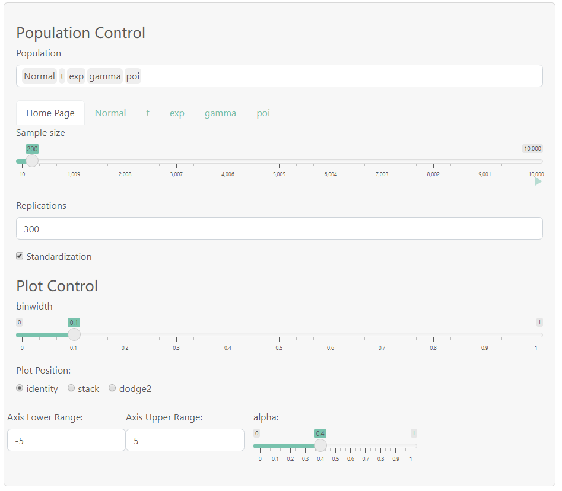
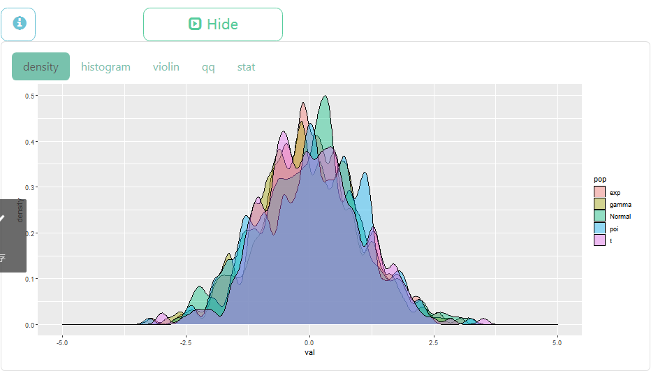

## 
**随机样本**

---

**侧边栏**可以选择并控制总体分布(基本是常见分布),可同时选择多个，下方会动态生成各个分布的控制面板

+ *Home Page* 

控制各组分布的样本容量n，抽样次数rep,是否标准化(影响中心极限定理的作图)

+ *分布名 如 Normal chi-square gamma ......*

    -  前面几行是常见分布的参数，建议输入有效值

    -   Statistic行可输入符合R语法的**向量化表达式**，得到统计量
    
        - x为样本,n为样本容量，可使用baseR与rlang的函数
    
        - 如:**mean(x),sd(x)^2 ,sort(x)[n]**，

          可分别得到样本均值 $\bar{x}$，样本方差 $\frac{\Sigma_1^n(x_i-\bar{x})^2}{n-1}$ ，样本最大值$x_{(n)}$
        - ~~实验功能，有待完善~~
        > 待填坑: 对数学公式的支持
+ **any** 使用Accept-Reject-Algorithm,生成满足一定条件的p.d.f的样本
        
    - 需要输入符合R语法的p.d.f表达式与其支集[a,b],上界M

    - 参数数目可选，依次为par1,par2,...

    - 限制较多，实用性不强

  
 
  
A-R算法详情

    
    $$ 设f为p.d.f,有紧致支集[a,b]与上界M,按如下算法,可得到r.v \  X \sim f \\
    Step \ 1.  生成随机变量Y \sim U(a,b)  \\ 
    Step \ 2.  生成随机变量V \sim U(0,M)  \\ 
    若 V \leq f(Y),则令X=V ; 否则，回到Step \ 1 \\ 
    Proof: \ 计算X的分布(转换为Y,V的条件概率)即可 \\
    Remark: \ 算法效率较低，且限制较多。
    $$
  

+   选择分布以后会出现Plot Control面板，可以控制作图，作图参数详见ggplot2

---

**主面板**生成并控制图像种类

+ Show Plot/Hide Plot 顾名思义

+ density 密度图

+ histogram 直方图

+ violin 小提琴图

+ qq Q-Q图

+ stat 生成自定义统计量的密度图(与Statistic行相关)

---