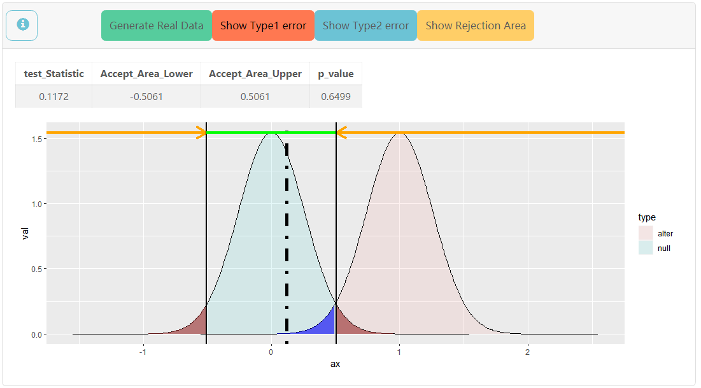

## 
**假设检验2**

处理两样本$x_1,x_2,x_3,...,x_n;y_1,y_2,y_3,...,y_m$情况的检验

#### observed-value 控制样本的真实分布，**非常强烈建议设置好参数后在进行检验，尤其是样本2，不然会报错**
  + level $ \alpha $ 控制检验水平，默认值0.05

  + Sample 1 控制样本一，控制面板同假设检验1

  + Sample 2 控制样本二，控制面板同假设检验1

#### 简单检验
  
  **控制逻辑是通用的**
    
  + Type of $H_0$ 选择假设种类，双边/单边

  + $\mu_0$ 控制$\Theta_0$边界值

  + test0 选择$\Theta_0$中的测试值

  + test1 选择$\Theta_1$中的测试值

##### Z

> 两样本Z检验，当两组样本的总体方差均已知时，对均值差$ \mu_1-\mu_2 $的检验

参数 $\sigma_1^2 \,  \, \sigma_2^2$ , 检验中“已知”的总体方差

##### F

> F检验，对两组样本方差之比$\frac{\sigma^2_1}{\sigma^2_2}$的检验

参数 $\mu_1 \, known \, ,\, \mu_2 \, known$ , 任一样本的均值是否已知，影响F分布的自由度(检验统计量也应变化，~~还没加上去~~)

##### t

> 两样本 $t$ 检验, 当两组样本的总体方差未知但已知相等时，对均值差$ \mu_1-\mu_2 $的检验

参数 $\sigma$ ， 检验中未知的总体标准差(影响test1曲线的生成)

>> 待填坑: 对正态总体方差信息完全无知时对均值差的检验

---
<h6 id='anchor4'></h6>

### 主面板

例图为Z检验  $H_0: \mu_0 = 0$ <-----> $H_1: \mu_0 \neq 0$

样本为$X_1,X_2,...,X_{15} \sim N(0,1) \ \ i.i.d$  

检验水平$\alpha = 0.05$,作图选取了 $test0 = 0,test1 = 1$

+ Generate Real Data 生成真实分布的样本(每次点击都会重新生成)

+ Show Type1 error,显示会发生Ⅰ型错的区域(图中深红部分)

+ Show Type2 error,显示会发生Ⅱ型错的区域(图中深蓝部分)

+ Show Rejection Area 显示拒绝域 (橙色箭头下方) 与接受域 (绿色线段下方)
  |test_Statistic |Accept_Area_Lower| Accept_Area_Upper|p_value|
  |:----------:|:------:|:------:|:------:|
  |当前样本所得到的检验统计量的值|接受域的下界|接受域的上界|当前样本的p值|

+ 图片中淡蓝区域边界为零假设下检验统计量的理论概率密度曲线，浅红区域边界为对立假设下检验统计量的理论概率密度曲线。**黑色虚线**为直线x=test_Statistic。

+ 解读:当前抽样样本的样本均值为-0.1330，落在拒绝域$R: (-\infty,-0.5061) \cup (0.5061,\infty)$外，故不能拒绝零假设

---